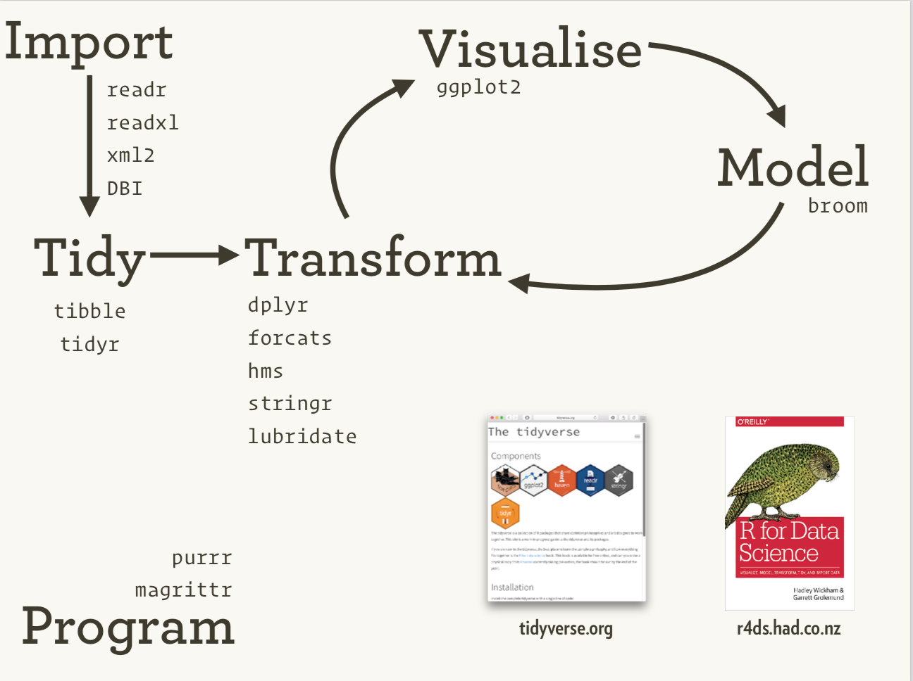
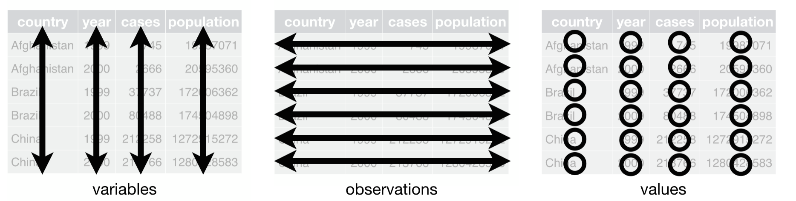

```{r setup, include=FALSE}
knitr::opts_chunk$set(echo = TRUE, message = FALSE, warning = FALSE)
library(tidyverse)
library(broom)
library(knitr)
library(kableExtra)
load('../data/nh.Rdata')
```

## Overview

In this module, we will cover:

1. The pipe operator (`%>%` and `|>`)
2. Six core dplyr verbs: `filter`, `select`, `mutate`, `arrange`, `summarize`, `group_by`
3. Recoding variables with `case_when`
4. Tidy data and reshaping with `pivot_longer`/`pivot_wider`
5. Visualization with ggplot2
6. Linear regression in R and the broom package
7. Running many regressions with `nest_by`

## The Tidyverse Ecosystem

```{r tidyverse-ecosystem, echo=FALSE, out.width="65%", fig.align="center"}

```

The tidyverse is an ecosystem of R packages for data science, originally conceived by Hadley Wickham.

## Our Dataset

We use NHANES data from the training set:

```{r prepare-data}
nhData <- NHData.train %>%
  select(BMXBMI, LBXGLU, RIDAGEYR, male, female,
         black, mexican, other_hispanic, other_eth, white,
         SDDSRVYR, LBXBPB, LBXBCD, INDFMPIR) %>%
  mutate(PID = row_number())
```

```{r show-data}
nhData %>% sample_n(5) %>%
  select(PID, BMXBMI, LBXGLU, RIDAGEYR, male, black, white) %>%
  kable() %>% kable_styling(font_size = 9)
```

## The Pipe Operator

The pipe `%>%` passes the output of one function as the first argument of the next:

```
x %>% f(y)   is equivalent to   f(x, y)
```

Base R also has a native pipe: `|>`

```{r pipe-demo}
# Without pipe
head(nhData, n = 3) %>% select(PID, BMXBMI, RIDAGEYR, male)

# With pipe
nhData %>% head(n = 3) %>% select(PID, BMXBMI, RIDAGEYR, male)
```

## Why Pipe?

Pipes make code more readable by expressing operations left-to-right:

```{r pipe-readable, eval=FALSE}
# Nested (hard to read)
head(arrange(filter(nhData, male == 1), -BMXBMI), 5)

# Piped (easy to read)
nhData %>%
  filter(male == 1) %>%
  arrange(-BMXBMI) %>%
  head(5)
```

## dplyr: Six Core Verbs

| Verb | Purpose |
|------|---------|
| `filter()` | Select rows by conditions |
| `select()` | Choose columns |
| `mutate()` | Create or modify columns |
| `arrange()` | Sort rows |
| `summarize()` | Collapse to summary statistics |
| `group_by()` | Partition data into groups |

## filter(): Select Rows

```{r filter-demo}
# Filter to males only
nhData %>%
  filter(male == 1) %>%
  select(PID, BMXBMI, LBXGLU, RIDAGEYR, male) %>%
  head(3) %>%
  kable() %>% kable_styling(font_size = 9)
```

## filter(): Multiple Conditions

```{r filter-multiple}
# Males with glucose >= 126 (diabetic range)
nhData %>%
  filter(male == 1, LBXGLU >= 126) %>%
  select(PID, BMXBMI, LBXGLU, RIDAGEYR, male) %>%
  head(5) %>%
  kable() %>% kable_styling(font_size = 9)
```

## select(): Choose Columns

```{r select-demo, eval=FALSE}
# Select specific columns
nhData %>% select(male, BMXBMI) %>% head(5)

# Remove columns
nhData %>% select(-c(PID, SDDSRVYR)) %>% head(5)

# Select by name pattern
nhData %>% select(starts_with("LB")) %>% head(5)
```

Other helpers: `ends_with()`, `contains()`, `matches()`, `one_of()`

## select(): Example Output

```{r select-output}
nhData %>%
  select(starts_with("LB")) %>%
  head(5) %>%
  kable() %>% kable_styling(font_size = 9)
```

## Combining filter and select

```{r filter-select}
nhData %>%
  filter(male == 1, LBXGLU > 100) %>%
  select(BMXBMI, LBXGLU) %>%
  head(5) %>%
  kable() %>% kable_styling()
```

## mutate(): Create New Columns

```{r mutate-demo}
nhData %>%
  mutate(
    obese = BMXBMI >= 30,
    t2d = LBXGLU >= 126
  ) %>%
  select(BMXBMI, obese, LBXGLU, t2d) %>%
  head(5) %>%
  kable() %>% kable_styling()
```

## case_when(): Recode Variables

`case_when` works like a switch statement inside `mutate`:

```{r case-when-demo}
nhData <- nhData %>%
  mutate(
    gender = case_when(
      male == 1 ~ "Male",
      female == 1 ~ "Female"
    ),
    ethnicity = case_when(
      white == 1 ~ "White",
      black == 1 ~ "Black",
      mexican == 1 ~ "Mexican American",
      other_hispanic == 1 ~ "Other Hispanic",
      other_eth == 1 ~ "Other"
    )
  )
```

## case_when(): Age Groups

```{r case-when-age}
nhData <- nhData %>%
  mutate(
    age_group = case_when(
      RIDAGEYR < 18 ~ "[0,18)",
      RIDAGEYR < 30 ~ "[18,30)",
      RIDAGEYR < 60 ~ "[30,60)",
      RIDAGEYR >= 60 ~ "[60+)"
    )
  )

nhData %>%
  count(age_group) %>%
  kable() %>% kable_styling()
```

## arrange(): Sort Rows

```{r arrange-demo}
nhData %>%
  select(BMXBMI, LBXGLU, gender) %>%
  arrange(-LBXGLU) %>%
  head(5) %>%
  kable() %>% kable_styling()
```

## summarize(): Collapse to Summary

```{r summarize-demo}
nhData %>%
  summarize(
    n = n(),
    mean_bmi = mean(BMXBMI, na.rm = TRUE),
    sd_bmi = sd(BMXBMI, na.rm = TRUE),
    mean_glucose = mean(LBXGLU, na.rm = TRUE)
  ) %>%
  kable(digits = 2) %>% kable_styling()
```

## group_by(): Partition Data

```{r group-by-demo}
nhData %>%
  group_by(gender) %>%
  summarize(
    n = n(),
    mean_bmi = mean(BMXBMI, na.rm = TRUE),
    mean_glucose = mean(LBXGLU, na.rm = TRUE)
  ) %>%
  kable(digits = 2) %>% kable_styling()
```

## group_by(): Multiple Groups

```{r group-by-multiple}
nhData %>%
  mutate(obese = BMXBMI >= 30) %>%
  group_by(gender, obese) %>%
  summarize(
    n = n(),
    mean_glucose = mean(LBXGLU, na.rm = TRUE),
    .groups = "drop"
  ) %>%
  kable(digits = 2) %>% kable_styling()
```

## Tidy Data

```{r tidy-data-fig, echo=FALSE, out.width="75%", fig.align="center"}

```

**Tidy data principles** (Hadley Wickham, inspired by E.F. Codd):

1. Each variable forms a column
2. Each observation forms a row
3. Each type of observational unit forms a table

## Is NHANES Tidy?

```{r is-tidy}
nhData %>%
  select(PID, BMXBMI, LBXGLU, gender, ethnicity) %>%
  sample_n(5) %>%
  kable() %>% kable_styling()
```

**Yes** — each row is one participant's measurements.

## pivot_longer(): Wide to Long

```{r pivot-longer}
nhData_long <- nhData %>%
  pivot_longer(
    cols = c(BMXBMI, LBXGLU),
    names_to = "measurement",
    values_to = "value"
  )

nhData_long %>%
  select(PID, measurement, value, gender) %>%
  head(6) %>%
  kable() %>% kable_styling()
```

## pivot_wider(): Long to Wide

```{r pivot-wider}
nhData_wide <- nhData_long %>%
  select(PID, measurement, value) %>%
  pivot_wider(names_from = measurement, values_from = value)

nhData_wide %>%
  head(5) %>%
  kable() %>% kable_styling()
```

## ggplot2: Grammar of Graphics

**Components of a ggplot:**

- `data`: the data frame
- `aes()`: aesthetic mappings (x, y, color, size, shape)
- `geom_*()`: geometric objects (points, bars, lines)
- `facet_*()`: faceting for small multiples
- `theme_*()`: appearance

```{r ggplot-syntax, eval=FALSE}
ggplot(data, aes(x = var1, y = var2)) +
  geom_point()
```

## Histogram

```{r histogram, fig.width=6, fig.height=3}
ggplot(nhData, aes(x = BMXBMI)) +
  geom_histogram(bins = 40, fill = "steelblue", color = "white") +
  labs(x = "BMI (kg/m²)", y = "Count", title = "Distribution of BMI") +
  theme_minimal()
```

## Histogram with Facets

```{r histogram-facet, fig.width=7, fig.height=3}
ggplot(nhData, aes(x = BMXBMI, fill = gender)) +
  geom_histogram(bins = 30, alpha = 0.7) +
  facet_wrap(~gender) +
  labs(x = "BMI (kg/m²)", y = "Count") +
  theme_minimal()
```

## Boxplot

```{r boxplot, fig.width=6, fig.height=3}
ggplot(nhData, aes(x = gender, y = BMXBMI, color = gender)) +
  geom_boxplot() +
  labs(x = "Sex", y = "BMI (kg/m²)", title = "BMI by Sex") +
  theme_minimal()
```

## Boxplot with Facets by Ethnicity

```{r boxplot-facet, fig.width=8, fig.height=3.5}
ggplot(nhData, aes(x = gender, y = BMXBMI, color = gender)) +
  geom_boxplot() +
  facet_wrap(~ethnicity) +
  labs(x = "Sex", y = "BMI (kg/m²)") +
  theme_minimal() +
  theme(legend.position = "none")
```

## Scatterplot

```{r scatter, fig.width=6, fig.height=3}
ggplot(nhData, aes(x = RIDAGEYR, y = BMXBMI, color = gender)) +
  geom_point(alpha = 0.2, size = 0.8) +
  labs(x = "Age (years)", y = "BMI (kg/m²)", title = "BMI vs. Age") +
  theme_minimal()
```

## Scatterplot with Facets

```{r scatter-facet, fig.width=7, fig.height=3}
ggplot(nhData, aes(x = RIDAGEYR, y = BMXBMI, color = gender)) +
  geom_point(alpha = 0.2, size = 0.5) +
  facet_wrap(~gender) +
  geom_smooth(method = "lm", se = FALSE, color = "black") +
  labs(x = "Age (years)", y = "BMI (kg/m²)") +
  theme_minimal()
```

## Linear Regression in R

Model the relationship: $y = \alpha + \sum_{i=1}^{M} \beta_i x_i$

```{r lm-demo}
fit <- lm(LBXGLU ~ BMXBMI + RIDAGEYR + male + black + mexican +
            other_hispanic + other_eth,
          data = nhData)
```

Three levels of output:

1. **Model level**: $R^2$, residual standard error
2. **Term level**: coefficient estimates, p-values
3. **Observation level**: predictions, residuals

## Model Summary

```{r lm-summary}
summary(fit)
```

## Interpreting the Coefficients

- `BMXBMI`: change in glucose per 1 kg/m² increase in BMI
- `RIDAGEYR`: change in glucose per 1 year increase in age
- `male`: difference in glucose for males vs. females (reference)
- `black`, `mexican`, etc.: difference vs. white (reference group)

Reference categories: **female** for sex, **white** for race/ethnicity.

## The broom Package

broom tidies model output into data frames:

| Function | Returns | Description |
|----------|---------|-------------|
| `glance()` | 1-row tibble | Model-level summary ($R^2$, AIC) |
| `tidy()` | Per-term tibble | Coefficients, p-values per variable |
| `augment()` | Per-observation tibble | Predictions, residuals |

## glance(): Model-Level Summary

```{r glance-demo}
glance(fit) %>%
  select(r.squared, adj.r.squared, sigma, p.value) %>%
  kable(digits = 4) %>% kable_styling()
```

## tidy(): Term-Level Summary

```{r tidy-demo}
tidy(fit) %>%
  select(term, estimate, std.error, p.value) %>%
  kable(digits = 4) %>% kable_styling(font_size = 9)
```

## augment(): Observation-Level

```{r augment-demo}
augment(fit) %>%
  select(LBXGLU, .fitted, .resid) %>%
  head(5) %>%
  kable(digits = 2) %>% kable_styling()
```

## Running Many Regressions with nest_by

**Goal**: Predict BMI and glucose as a function of age, sex, ethnicity — stratified by survey year.

**Step 1**: Make data long

```{r many-reg-long}
nhData_long <- nhData %>%
  pivot_longer(cols = c(LBXGLU, BMXBMI),
               names_to = "outcome",
               values_to = "value")
```

## Step 2: nest_by and Fit Models

```{r many-reg-nest}
regressions <- nhData_long %>%
  nest_by(outcome, SDDSRVYR) %>%
  mutate(fit = list(lm(value ~ RIDAGEYR + male + black + mexican +
                         other_hispanic + other_eth,
                       data = data))) %>%
  select(-data)
```

```{r many-reg-show}
regressions
```

## Step 3: Extract R² from Each Model

```{r many-reg-glance}
regressions %>%
  summarise(glance(fit)) %>%
  select(outcome, SDDSRVYR, r.squared) %>%
  arrange(outcome, SDDSRVYR) %>%
  kable(digits = 3) %>% kable_styling()
```

## Step 4: Extract Coefficients from Each Model

```{r many-reg-tidy}
regressions %>%
  summarise(tidy(fit)) %>%
  select(outcome, SDDSRVYR, term, estimate, p.value) %>%
  head(10) %>%
  kable(digits = 3) %>% kable_styling(font_size = 9)
```

## Putting It All Together

The tidyverse workflow for ExWAS:

1. **Load and clean** data with dplyr (`mutate`, `filter`, `select`)
2. **Reshape** data with tidyr (`pivot_longer`)
3. **Visualize** data with ggplot2
4. **Model** with `lm()` or `svyglm()`
5. **Tidy** results with broom (`tidy`, `glance`)
6. **Scale** analyses with `nest_by` + `map`

## Summary

- The **pipe** operator makes code readable and composable
- **dplyr** provides 6 core verbs for data manipulation
- **case_when** enables flexible variable recoding
- **pivot_longer/wider** reshapes data between wide and long formats
- **ggplot2** creates publication-quality visualizations
- **broom** tidies model output for downstream analysis
- **nest_by** scales regressions across groups

## What's Next?

**Module 3: Statistical Foundations for ExWAS**

- Survey sampling and svydesign/svyglm
- Log transformation and standardization
- Multiple testing correction
- Confounding and DAGs
